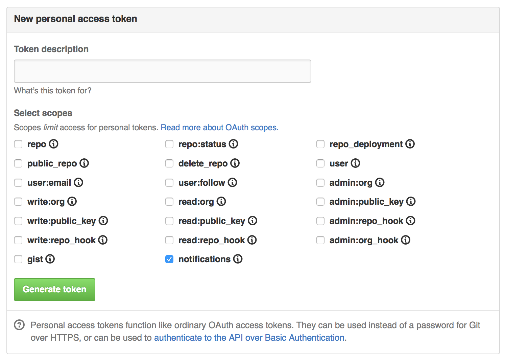

# GitHub Notifications As Desktop Notifications

First, make an access token. Go to https://github.com/settings/tokens/new and
create a new token. Uncheck all of the boxes which are checked by default.
Check the `notifications` box. Click the big green `Generate Token` button and
copy the token.

Also install the requests library and make sure it's accessible by the user
who's going to be running this.



Next create a config file called `.gh-desktop-notifications.json`. It should
have the following form:
```json
{
  "oauth_token": "generated token goes here",
  "script": "command to show a desktop notification goes here with {text} and {title}"
}
```

The `{text}` and `{title}` will be replaced with the text and title of the
command using normal python string interpolation.

On OS X a suitable command to show a desktop notification would be:
```
"/usr/bin/osascript -e 'display notification \"{text}\" with title \"{title}\"'"
```

On Linux with Gnome3 it might be something like:
```
notify-send '{title}' '{text}'
```

On Linux with i3 it might be something like:
```
i3-nagbar -m {text}
```

I haven't checked the Linux examples yet.

To run the script every 5 minutes, run `crontab -e`, and then add the following
entry:
```
*/5 * * * * bin/gh-desktop-notifications.py
```
